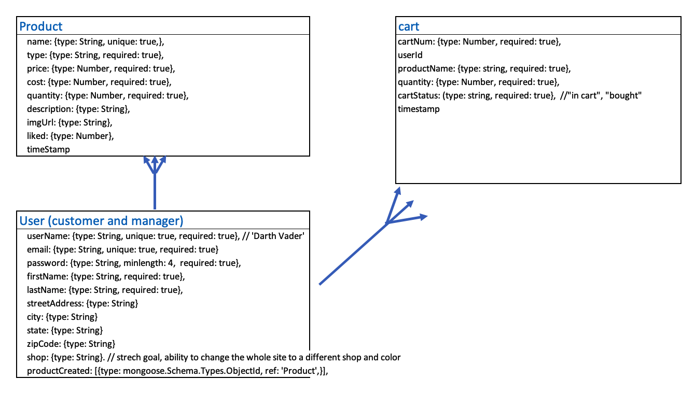

Plum & Pear Store is a use case of useing an e-commerce template that serves both the customers and the shop owner.  It provides product infomation, create account, login, and the ability to add porduct to favorite.  The owner has a dashboard to see highlevel information of the inventory and the sales/revenue numbers.  The owner would able to vew, create, update and delete inventory.

Technology: MongoDB, Mongoose, Express, React.js, Node.js, Stripe API

User stories:

** Customer
* Able to view all products and product detail
* Create an account; username, first and last name, email, address
* Can like or unlike a product
* Logged in customer can see items they liked
* Able to add 1 or more products into shopping
* can reduce quantity of the item in the cart
* if customer logged out before making purchase, items in the cart will be save for the user
* can make a purchase via Strip with credit card
* after purchase, inventory count will be updated accordingly

** Owner
* Login as admin with ablity to update (full CRUD) inventory
* Able to see a store dashboard that includs inventory summary
* only admin cann certain page and nav bar changes accordingly

Extras:

* Able to checkout via Paypal/Strips (done)
* Shopping for Customer - able to add, veiw, update quantity, remove products in the cart (done)
* Logged in customer can see items in the cart that were left in since last session (done)
* Able to use Google sheet to update inventory and upload to the app
* able to download the MongoDB data to Google sheet
* A switch for owner to change the shop to sell different products and different them for the stories
* customer wish list
* Auto welcome email
* Auto email reciept to customer
* dashboard includes charts, sales, and profitability
* upload images

Wireframe:

ERD:

